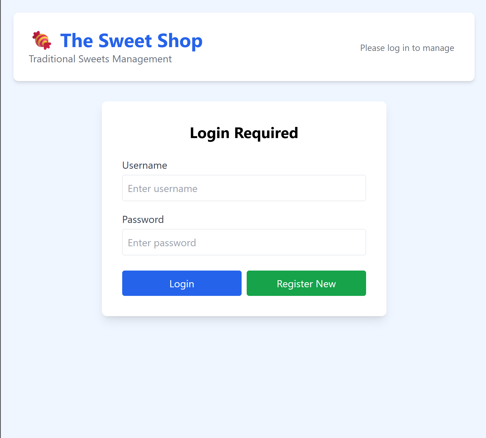
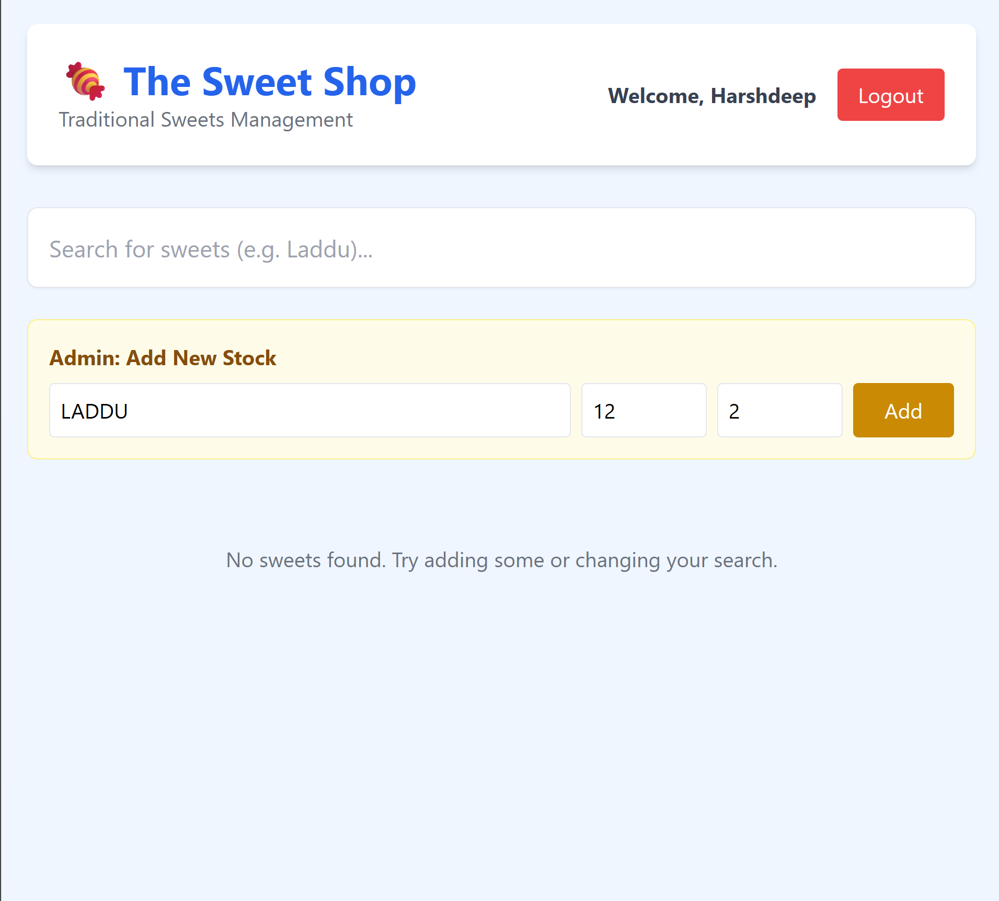

# Sweet Shop Management System

A full-stack application to manage a traditional sweet shop inventory.

## Setup
1. `pip install -r requirements.txt`
2. Run Backend: `uvicorn main:app --reload`
3. Open `frontend/index.html` in browser.

## My AI Usage
* **Tools Used:** ChatGPT/Gemini
* **How I used them:**
    * I used AI to generate the CSS (Tailwind) for the frontend to ensure it was responsive and looked modern.
    * I used AI to help structure the initial boilerplate for FastAPI.
* **Reflection:** I focused on writing the TDD logic and backend business rules manually to ensure I understood the core logic. AI was helpful for speeding up the UI design.

## Screenshots

